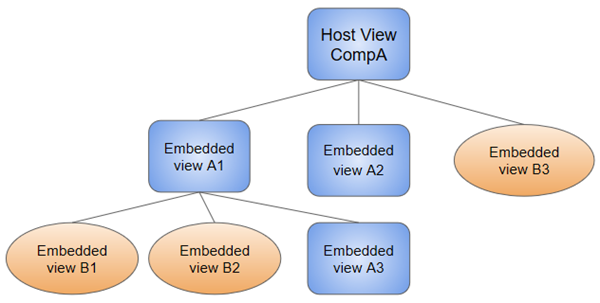

## Módulos

Módulos são containers de códigos coesos que são aplicados a um domínio da aplicação, um workflow, ou um conjunto
de funções relacionadas. Eles podem conter componentes, services, e outros arquivos de código cujo escopo é definido
pelo NgModule do módulo. Módulos podem importar funcionalidades que são exportadas de outros módulos, e exportar
funcionalidades selecionadas para serem usadas em outros módulos.

### NgModule Metadata

Um NgModule é definido por uma classe anotada com `@NgModule()`. A anotação `NgModule()` é uma função que recebe um
único objeto de metadata, cujo propriedades descrevem o módulo. 
<br /> <br /><b>As propriedades mais importantes são:</b> <br />

`declarations`: Os componentes, diretivas e pipes que pertencem a esse <i>NgModule</i>.<br>
`exports`: O conjunto de declarações que serão exportadas para poderem ser usadas em outros <i>NgModule</i><br>
`imports`: Outros módulos importados para este <i>NgModule</i><br>
`providers`: Criadores de <i>services</i> que esse <i>NgModule</i> contribui para a coleção global de serviços;
eles começam a ser acessíveis in todas as partes da aplicação. (Você também pode especificar `providers` no level do componente). <br>
`bootstrap`: A main view da aplicação, chamada de <i>root component</i>, que hospeda todas as outras views da aplicação.
Apenas o <i>NgModule</i> deve setar a propriedade `bootstrap`.<br>

<br>
<b>
Exemplo de NgModule:<br></b>

```
import { NgModule } from '@angular/core';
import { BrowserModule } from '@angular/platform-browser';

@NgModule({
  imports:      [ BrowserModule ],
  providers:    [ Logger ],
  declarations: [ AppComponent ],
  exports:      [ AppComponent ],
  bootstrap:    [ AppComponent ]
})

export class AppModule { }
```
<hr>

### NgModules e componentes

NgModules proveêm um compilado de contexto para os seus componentes. Um <i>root</i> NgModule sempre tem um 
componente criado durante o bootstrap, mas qualquer NgModule pode incluir qualquer número de componentes adicionais,
quais podem ser carregados através do <i>router</i> ou criados através do template. Os componentes que pertencem a um NgModule
compartilham um compilado de contexto.<br>


<br>
Um componente e seu template juntos definem uma <i>view</i>. Um componente pode conter uma <i>view hierarchy</i>,
que te permite definir arbitrariamente áreas complexas da tela que podem ser criados, modificados e destruídos
como uma unidade. Uma <i>view hierarchy</i> pode misturar views definidas nos componentes que pertencem a NgModules diferentes.
Isso é geralmente o caso, especialmente para UI libraries.<br>

o

<br>
Quando você cria um componente, é associado diretamente com uma única view, chamada de <i>host view</i>. A host view
pode ser o <i>root</i> de uma hierarquia, que pode conter views embutidas, quais são tornadas as views host
de outros componentes. Esses componentes que podem estar no mesmo <i>NgModule</i>, ou podem ser importados por outros
NgModules.<br>

Views na árvore podem ser aninhadas para qualquer profundidade.

